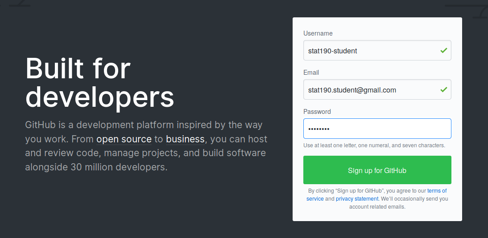
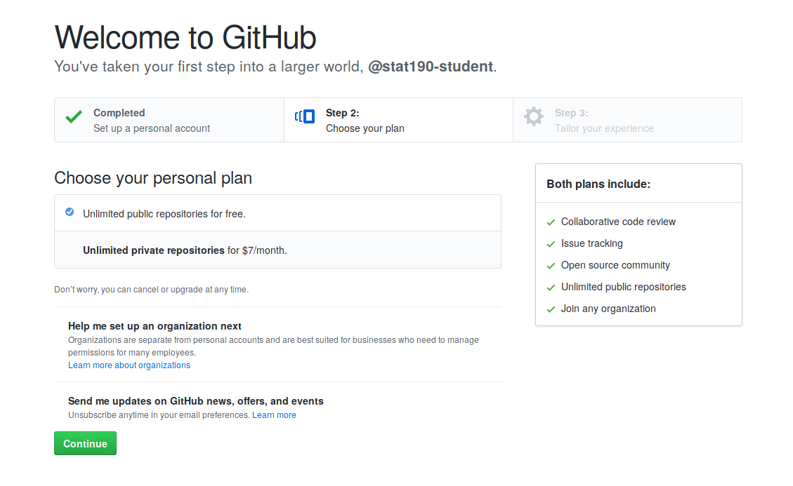
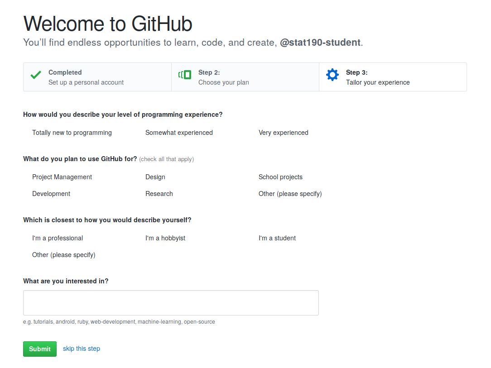
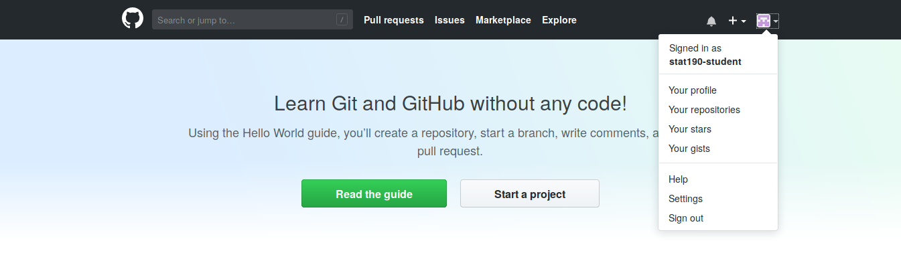
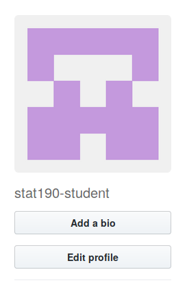
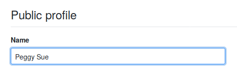
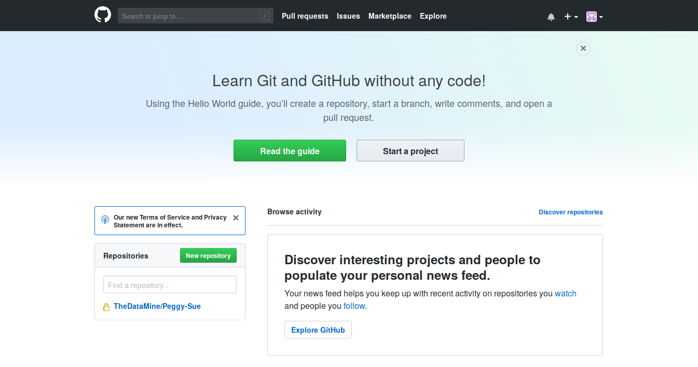
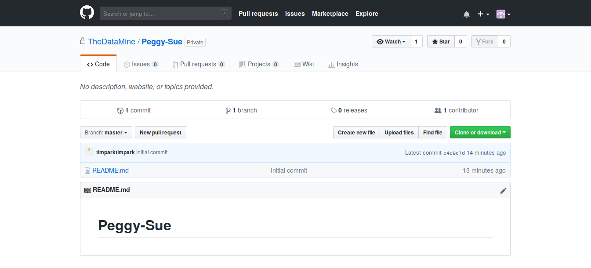
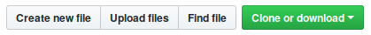

# STAT 19000
The official STAT 19000 GitHub repository


## Table of Contents

- [Create a GitHub account](#create-a-github-account)
- [How to submit assignments](#how-to-submit-assignments)
- [Submission guidelines](#submission-guidelines)
- [View your grades](#view-your-grades)
- [Office hours](#office-hours)

## Create a GitHub Account
> If you already have a GitHub account, do not worry about making a new one-- just skip this step!

- Go to github.com
- Fill in the sign-up form on the main page and press 'Sign up for GitHub'

Example sign up form:


- On the next page, press the green 'continue' button:


- The next portion is a survey. Fill it out, or press 'skip this step':



You are now the proud owner of a GitHub account! The next step is to add your name to your profile, so we can better identify you.

- Press your profile icon and click 'Your profile' from the dropdown:


- On your profile page, click 'Edit profile':  


- Add your name, first and last:  


- Press 'Update profile' to save your changes.

**Once you are done creating your account, email your name and GitHub username to a STAT 190 TA so we can create your assignment repository!**

## How to submit assignments

### For first-time submissions
- Check your email inbox for a repository invite
    - If you can't find an invite, navigate to https://github.com/thedatamine/FIRSTNAME-LASTNAME
- Accept the invite
- Continue to the [next step](#for-returning-customers)

### For returning customers
- Go to https://github.com/thedatamine
- Click on the repository named after you (ex. Peggy-Sue):

- You should now be on your assignment repository page:

- Click on the button labeled 'Upload files':


- Drag and drop any project folders you wish to submit for grading
- Press 'Commit changes' to submit your work

If all went well, you should now see your submitted work in your assignment repository!

## Submission guidelines
For all projects, place all relevant files into a folder labeled as such:
```
project_01
```
Relevant files include any temporary files you may have created to solve a problem, or RMarkdown output. If you care at all about your TAs, try to keep extraneous files out of your submitted project folders.

## View your grades
All grades will be posted on [Blackboard](https://mycourses.purdue.edu/).

## Office hours
To be determined. Stay tuned!
